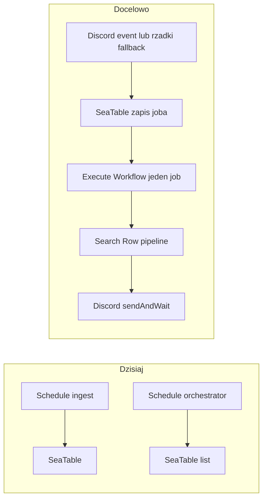

# Plan: SeaTable tylko po Discordzie + ścieżka do approve

**Cel:** ograniczyć liczbę wywołań API SeaTable przez usunięcie ciągłego harmonogramu (ingest + listowanie widoku `to-process`) na rzecz startu od zdarzenia Discord i przetwarzania jednego `job_id` na wywołanie.

**Powiązanie z roadmapą:** [roadmap.md](../roadmap.md) — sekcja **P0**.

---

## Review i zatwierdzenie

Przed wdrożeniem proszę:

- [ ] Przeczytać poniższy plan i diagram.
- [ ] Zatwierdzić kierunek (Discord trigger vs webhook; wariant A/B orchestratora).
- [ ] Potwierdzić akceptowalność opcjonalnego **rzadkiego** crona recovery (np. 30–60 min).
- [ ] Po merge: `node scripts/n8n/push-workflows.mjs` + weryfikacja na VPS.

**Reviewerzy (propozycja):** właściciel produktu / osoba odpowiedzialna za n8n + SeaTable.

---

## Co jest dziś

- [cg-ingest-discord.json](../../workflows/ingest/cg-ingest-discord.json): `Schedule Trigger` (np. co 2 min) → **SeaTable** (config / `discord_last_message_id`) → **Discord** `getAll` → filtr → **SeaTable** create job + aktualizacja kursora.
- [cg-orchestrator-main.json](../../workflows/orchestrator/cg-orchestrator-main.json): `Schedule Trigger` → **SeaTable** list widok `to-process` → Search Row → reszta (w tym **Generate Content**, preview, **Discord** `sendAndWait`, **Parse Response**).

**Ważne:** węzeł **Discord Preview** ma `operation: sendAndWait` — wykonanie workflow **zawiesza się na odpowiedzi użytkownika na Discordzie**. To nie jest „polling SeaTable do approve”; approve jest **zdarzeniem z Discorda**. Dodatkowe odpytywanie bazy w pętli „aż approved” **zwiększyłoby** zużycie API i nie jest potrzebne, jeśli zostaje `sendAndWait`.

## Rekomendowany kierunek architektury

1. **Start od wiadomości Discord**  
   Zastąpić (lub uzupełnić) ingestowy cron **triggerem zdarzeniowym**: w n8n typowo **Discord Trigger** (wiadomość na kanale) albo **Webhook**. Wtedy pierwsze zapytania do SeaTable przychodzą **tylko gdy jest nowa wiadomość** (plus ewentualnie zapis joba i kursor — zależnie od deduplikacji).

2. **Koniec okresowego listowania `to-process`**  
   Po utworzeniu wiersza w **SeaTable Create Job** dodać **Execute Workflow** wywołujący przetwarzanie **jednego** `job_id` (ten sam orchestrator po refaktorze albo nowy workflow `cg-process-job` z `Execute Workflow Trigger`).  
   Zamiast: `list` widoku → pętla po jobach — masz: **jedno** wywołanie na job, wejście z `job_id` (i ewentualnie polami z ingestu).

3. **„Do momentu approve”**  
   - **Zostawić** łańcuch: generacja → preview → **`sendAndWait`** → parse → gałęzie approve / reject / revise.  
   - **Nie** wprowadzać pętli typu „co N sekund czytaj `approval_status` z SeaTable”.  
   - **Revise:** w orchestratorze ścieżka kończy się na **Discord: Revising** bez widocznego połączenia z powrotem do **Generate Content** — przy przejściu na event-driven warto **jawnie** zdefiniować: albo pętla workflow (revise → ponownie Generate → znowu `sendAndWait`), albo ponowne **Execute Workflow** z `job_id` po aktualizacji wiersza (spójnie z widokiem `to-process` / statusem).

4. **Bezpiecznik (opcjonalny)**  
   Jeden **rzadki** harmonogram (np. co 30–60 min) tylko do **odtworzenia** jobów po awarii (np. ingest się udał, ale Execute Workflow padł).

## Konkretne zmiany w repo

| Obszar | Działanie |
|--------|-----------|
| [cg-ingest-discord.json](../../workflows/ingest/cg-ingest-discord.json) | Dodać trigger Discord (lub webhook); uprościć lub usunąć gałąź „tylko kursor” zależnie od tego, czy nadal potrzebujesz `discord_last_message_id` w SeaTable (przy czystym triggerze często wystarczy deduplikacja po `discord_msg_id` w tabeli `jobs`). |
| [cg-orchestrator-main.json](../../workflows/orchestrator/cg-orchestrator-main.json) | Wariant A: zamienić `Schedule Trigger` + `Get Jobs To Process` na **Execute Workflow Trigger** z wejściem `job_id`; pierwszy SeaTable to **Search** po `job_id` (jak dziś **Search Row ID**). Wariant B: osobny plik workflow tylko pod „jeden job” i wywoływać go z ingestu. |
| Wyrażenia n8n | Zastąpić `$('Get Jobs To Process').first().json.*` danymi z **triggera** lub z wyniku **Search Row**. |
| Dokumentacja / reguły | Zaktualizować [onboarding.md](../onboarding.md) i ewentualnie [.cursor/rules/n8n-vps-deploy.mdc](../../.cursor/rules/n8n-vps-deploy.mdc) pod nowy przepływ + `push-workflows`. |

## Ryzyka / decyzje

- **Limit równoległości:** wiele wiadomości naraz = wiele równoległych wykonań; świadomie ustawić politykę (kolejka vs równolegle).
- **Discord Trigger vs obecny `getAll`:** trigger wymaga poprawnej konfiguracji bota i kanału; przy migracji warto krótko **równolegle** trzymać rzadki cron jako rollback.
- **Plus / SeaTable:** zmiany nie rozwiązują błędów typu „big data storage” — to osobno credential / baza.

## Podsumowanie

Kierunek (**baza gdy jest wiadomość**, **aktywność do approve** przez Discord) jest **trafiony** pod kątem limitów API, pod warunkiem że **„odpytywanie do approve” = kolejne rundy `sendAndWait` / pętla w workflow**, a **nie** timer czytający SeaTable.

## Zadania realizacyjne (checklist techniczna)

- [ ] Wybrać: Discord Trigger w n8n vs webhook; cursor `discord_last_message_id` vs dedup po `discord_msg_id`.
- [ ] Zastąpić Schedule + list `to-process` przez Execute Workflow Trigger + Search po `job_id`; poprawić wszystkie `$('Get Jobs To Process')`.
- [ ] Ustalić i zaimplementować zamkniętą pętlę revise → Generate → sendAndWait.
- [ ] Po SeaTable Create Job dodać Execute Workflow z `job_id`; opcjonalnie rzadki cron recovery.
- [ ] Zaktualizować docs/reguły deploy i wypchnąć workflowy na VPS.
