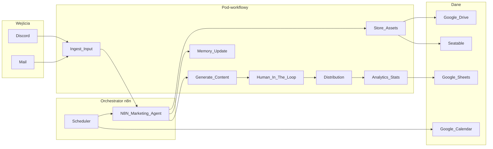

# Roadmap: CG Marketing Agent

Dokument zbiera ustalenia dotyczące automatyzacji marketingowej opartej na **n8n** (self-hosted). Diagram wyjściowy: [agent.excalidraw](agent.excalidraw). Zasady projektu: [shared-rules.md](shared-rules.md).

**Status:** roadmapa **w użyciu** — dokument żywy (edycje mile widziane); realizacja zgodnie z checklistą i iteracjami I0+.

**Powiązane pliki robocze:** [job-contract.md](job-contract.md) (kontrakt `job`), [decisions-three-variants.md](decisions-three-variants.md) (3 warianty decyzji), [credentials-registry.md](credentials-registry.md) (credential’e + koszty).

---

## Zakres i założenia

- **Stack:** cała orkiestracja w **n8n** — orchestrator + mniejsze workflowy, przekazywanie danych przez ustandaryzowany JSON (np. `Execute Workflow` / webhooki).
- **Wdrożenie:** **lokalnie** (np. Docker) **bez n8n Cloud**; **migracja na VPS dopiero wtedy, gdy cały system jest bliski ukończenia** (funkcje domknięte, sensowny zakres testów już za sobą) — nie na wczesnym etapie „żeby tylko przetestować”. Do tego czasu: **tunel** (np. Cloudflare Tunnel) lub inne rozwiązanie z publicznym URL bez własnego VPS.
- **Koszt:** priorytet **niskiego nakładu** (darmowe tiery, świadome limity API); przy większych decyzjach obowiązuje **trzy warianty** (darmowy / niewielki koszt / drogi) z opisem **efektu**, nie tylko ceny.
- **Praca:** **iteracje** z pomiarem efektu i kosztu oraz **go/no-go** przed poszerzeniem zakresu.

---

## Co wynika z diagramu (agent.excalidraw)

**Wejście:** Discord, Mail — zdjęcia, filmiki, polecenia, materiały stałe (logo, avatar).

**Wyjście:** posty (Facebook, LinkedIn, X, Instagram), wideo (YouTube, TikTok, itd.), powiadomienia (Mail, Discord), **Human in the loop**.

**Środek:** agent z modelami, **HTCI** (szablon + logo + zdjęcia), **pamięć**, **dystrybucja** z **specyfikacją per kanał**, pętla **poprawka / wycofanie**, Scheduler, **N8N Marketing Agent**.

**Magazyn:** Google Drive i/lub Seatable, Google Kalendarz, Google Sheets. Opcje na brzegu: Discord?, BLOG SEO?, Statystyki?

**Przepływ treści (semantyka):** **agent zbiera i scala informacje ze wszystkich inputów** (kanały, polecenia, pliki, załączone zdjęcia i materiały, specyfikacja kanału wyjścia, pamięć, kalendarz itd.), **na tej podstawie składa zaawansowany prompt** (m.in. pod generację grafiki lub copy), który **steruje generowaniem treści**. Zdanie „prompt tworzy agenta” odrzuca **błędne uproszczenie**: że wystarczy jeden statyczny meta-prompt zamiast procesu agregacji — **to agent składa prompt pod konkretne zadanie z realnych wejść**, a nie odwrotnie.

**Architektura logiczna:** jeden **workflow-orchestrator** i **wiele pod-workflowów** (jedna odpowiedzialność każdy), wspólny **kontrakt danych** (`job`).

---

## Strategia wdrożenia: lokalnie (długo) → VPS na końcu

| Etap | Opis |
|------|------|
| **Rozwój i większość testów** | n8n **self-hosted** na maszynie lokalnej; brak n8n Cloud. Publiczne webhooki / OAuth: **tunel** (Cloudflare Tunnel, ngrok itd.) — bez VPS. |
| **Migracja na VPS** | **Dopiero gdy system jest blisko ukończenia** (planowane funkcje w dużej mierze zaimplementowane, sensowna stabilizacja). Wtedy **wybór VPS**, ten sam model self-hosted, eksport/import workflowów lub bazy n8n, stały URL (`N8N_HOST`, reverse proxy, TLS). To jest **krok przed utrzymaniem produkcyjnym / docelowym hostingiem**, nie zamiast tunelu na etapie budowy. |
| **Po migracji** | **Aktualizacja redirect URI** i webhooków u providerów (OAuth, boty) na adres produkcyjny. |

**API n8n** (`N8N_API_URL`, `N8N_API_KEY`) dotyczy **Waszej** instancji — szablon zmiennych: [.env.example](../.env.example).

---

## Niski koszt — zasady operacyjne

- Orchestracja: **n8n self-hosted** (bez n8n Cloud).
- Dane: **Seatable** (free tier, 10k wierszy/bazę) jako główny magazyn `job`; **Google Drive** na assety; **Google Sheets** tylko do rejestru kosztów i raportów analitycznych.
- Wejścia: Discord Bot (serwer TEAM CG, kanał `cg-agent`), mail z istniejącej skrzynki gdy możliwe.
- AI: start od **tanich modeli / limitów** w workflow; lokalny LLM (Ollama) tylko gdy jakość i koszt czasu są akceptowalne.
- HTCI: **szablony + logo + upload** zanim płatna generacja obrazu; batch i cache.
- Social: **jeden kanał na iterację**; bez dodatkowych SaaS cross-post na start.
- VPS: przez **długi czas 0 zł** na hosting aplikacji (lokalnie + tunel); **wynajem VPS dopiero przy domykaniu systemu** — najmniejszy sensowny tier pod produkcję, skalowanie po metrykach.
- **Arkusz kosztów** (np. w Sheets): szacunki miesięczne — aktualizacja po każdej iteracji.

**Akceptowalny efekt** definiować **per iterację**, nie „wszystkie platformy od razu”.

---

## Trzy warianty przy decyzjach

Przy każdej większej decyzji (hosting, dane, AI, obrazy, kanał): zapisać **darmowy**, **niewielki koszt**, **drogi** oraz **jaki efekt** daje każdy.

| Wariant | Typowo | Efekt (realistycznie) |
|---------|--------|------------------------|
| **Darmowe** | Self-host, darmowe tiery, tunel z limitami, szablony zamiast gen AI, jeden kanał | Wąski zakres E2E; więcej HITL; limity tunelu |
| **Niewielki koszt** | Mały VPS, modele „mini”, Sheets w sensownych limitach | Stabilny URL, sensowna jakość copy, umiarkowany wolumen |
| **Drogie** | Większy VPS/GPU, flagowe modele, płatna baza, wiele kanałów naraz | Najmniej pracy ludzkiej, najwyższa jakość — wymaga kontroli ROI |

**Przykłady:** publiczny URL (**przez długi czas tunel**; **mały VPS dopiero przy domykaniu systemu** — porównanie z tunel vs większy VPS+backup); warstwa `job` (Sheets vs Seatable vs baza); tekst (kredyty/tani model vs średni vs top); obrazy (tylko szablony vs tanie API vs premium); dystrybucja (jeden kanał vs więcej vs SaaS analytics).

W iteracji najpierw wariant **darmowy** lub **niewielki koszt**; **droższy** po pozytywnym pomiarze.

---

## Działanie iteracyjne

Zamiast realizować wszystkie fazy naraz — **krótkie iteracje**, przyrost działający, **pauza** na ocenę.

1. **Cel** — jedno zdanie (np. „Discord → arkusz + powiadomienie”).
2. **Zakres** — minimum do celu; dla nowych elementów **tabela 3 wariantów**.
3. **Implementacja** — pod-workflowy + kontrakt `job`.
4. **Pomiar** — jakość, liczba wywołań API, czas ludzi, koszt z paneli.
5. **Go/no-go** — poszerzenie zakresu / tieru albo obniżenie kosztu.

**Mapowanie iteracji (orientacyjnie):**

| Iteracja | Zakres | Status |
|----------|--------|--------|
| **I0** | Faza 0: lokalne n8n, konwencje, `.env`; opcjonalnie tunel | **done** — Docker, `.env.example`, onboarding, konwencje git, reguły IDE |
| **I1** | Faza 1–2: credential'e, kontrakt `job`, jedno wejście (Discord) + Seatable/Drive | **w toku** — kontrakt `job` (szkic), rejestr credentiali, Seatable; w n8n i repo: `cg-ingest-discord`, `cg-hitl-discord-reply`; API n8n + eksport workflowów do `workflows/` |
| **I2** | Faza 3: ingest → orchestrator → HITL lub tania generacja tekstu | **w toku (częściowo)** — `cg-orchestrator-main` + `cg-gen-content` (Gemini), HITL przez Discord `sendAndWait` w orchestratorze; **do domknięcia:** rozdzielenie **input vs feedback** na Discordzie, spójne widoki `to-process` w Seatable, ograniczenie równoległych runów schedulera względem **Waiting** |
| **I3** | Jeden kanał social; scheduler w wersji minimalnej (np. ręczny trigger) | planned |
| **I4+** | Faza 4 (agent, HTCI, pamięć), pełny scheduler, kolejne kanały, Faza 6 | planned |

Po **I2–I3** warto **zatrzymać się** na ocenę, zanim doda się drogie modele lub wiele integracji.

---

## Stan implementacji i otwarte problemy (2026-04-07)

**Instancja lokalna n8n** (np. port 5679, `N8N_API_*` w `.env`): działają workflowy **cg-ingest-discord**, **cg-gen-content** (sub-workflow), **cg-orchestrator-main** (schedule co 2 min, lista z widoku Seatable `to-process`, **Mark Generating** → `generating`, potem generacja, zapis `awaiting_approval`, preview na Discordzie), **cg-hitl-discord-reply** (legacy: polling widoków — zwykle wyłączony, gdy HITL jest w orchestratorze).

**Repozytorium `workflows/`:** cztery eksporty zsynchronizowane ze skryptem `scripts/n8n-export.sh`: `ingest/`, `hitl/`, `orchestrator/`, `generate/`.

**Ustalenia operacyjne (debug):**

- Węzeł SeaTable **Mark Generating** musi faktycznie wysłać aktualizację kolumny **`status` = `generating`** — pusta sekcja „Columns to Send” powoduje, że job zostaje w kolejce i schedulery mogą **wielokrotnie** generować treść dla tego samego `job_id`.
- Widok **`to-process`** powinien obejmować wyłącznie stany **kolejki roboczej** (np. `ingested`, `revision_needed`) i **nie** zawierać `generating` ani `awaiting_approval` — inaczej ten sam rekord może być ponownie pobrany przy kolejnym ticku.

**Do rozwiązania — zarządzanie input vs feedback (Discord):**

- **Problem:** Jeden kanał Discord jest czytany przez **ingest** oraz przez orchestrator (**`sendAndWait`** na preview). Wiadomość z intencją *feedback* mogła trafić jako **nowy job**; równolegle harmonogram orchestratora uruchamia **osobne** wykonania niezależnie od **Waiting**.
- **Częściowo wdrożone (2026-04-08):** `cg-ingest-discord` — pomija **reply** (`message_reference`), zawsze **aktualizuje kursor** `discord_last_message_id` (ścieżka „tylko reply” → brak zapętlenia).
- **Warianty dalsze (do wyboru lub łączenia):**
  1. **Dodatkowy kanał** — ingest tylko na kanale zleceń vs preview/HITL osobno.
  2. **Flagowanie** — prefiks / slash / reguły na wątek (dla feedbacku **bez** reply pod wiadomością).
  3. **Router AI (cienka warstwa)** — klasyfikacja intencji; twarde reguły zostają pierwsze.
- Szczegóły: [decisions-three-variants.md — § 4](decisions-three-variants.md).

---

## Architektura logiczna (n8n)



**Wzorzec:** orchestrator wywołuje pod-workflowy (**Execute Workflow** / webhook), payload: np. `job_id`, `channel_spec_id`, `assets[]`, `prompt_context`, `status`. Stan: **Sheets/Seatable** + **Drive** (wycofanie, wersje).

---

## Fazy roadmapy

### Faza 0 — Fundament

- n8n self-hosted lokalnie, backup volume, wersja zgodna z węzłami; bez n8n Cloud.
- Sekrety poza Gitem ([.env.example](../.env.example)).
- Nazwy workflowów: `cg-orchestrator-*`, `cg-ingest-*`, `cg-gen-*`, itd.

### Faza 1 — Credential’e

Matryca kont i integracji w **n8n Credentials** (osobno dev/prod jeśli potrzeba):

| Obszar | Serwis | Uwagi |
|--------|--------|--------|
| Orchestracja | n8n (self-hosted) | API Key — URL lokalny lub VPS |
| Wejścia | Discord, Mail | Bot token / IMAP/SMTP |
| Dane | Drive, Sheets, Calendar, Seatable? | OAuth / token |
| AI | Dostawca LLM | API key, limity |
| Obrazy / wideo | API zgodnie z HTCI | API key |
| Social | Meta, LinkedIn, X, YouTube, TikTok | OAuth; **największy nakład konfiguracji** — osobne „Developer App”, często **App Review** (czas, nie tylko pieniądze) |
| Opcjonalnie | Discord | Bot token |

**Uwaga (Meta / IG / FB):** „długa weryfikacja” to proces **App Review** / ewentualnie **Business Verification** po stronie Meta — **często tygodnie** zanim aplikacja dostanie potrzebne uprawnienia do publikacji w produkcji.

### Faza 2 — Kontrakt `job`

- Pola np.: `job_id`, `created_at`, `source`, `content_type`, `channels[]`, `assets`, `channel_specs`, `approval_status`, `publish_at`.
- Źródło prawdy: **Seatable** (relacje, widoki, REST API); Drive na assety binarne.
- Kalendarz: sloty powiązane z `job_id`.

### Faza 3 — Pierwszy pionowy slice

1. `cg-ingest-unified` — Discord/Mail → `job` + Drive.
2. `cg-store-assets` — logo, avatar, szablony HTCI.
3. `cg-orchestrator-main` — routing; **jeden kanał testowy**.
4. `cg-human-in-the-loop` — zatwierdzenia; aktualizacja statusu.
5. `cg-distribute-channel-*` — osobny workflow na platformę.

### Faza 4 — Agent i treści

- `cg-agent-build-content-prompt` (lub `cg-agent-synthesize-prompt`) — agregacja inputów → **jeden zaawansowany prompt** → generacja treści.
- `cg-htci-template` — szablon + logo + zdjęcia.
- `cg-memory-update` — pamięć operacyjna (Sheets/Seatable; opcjonalnie RAG później).

### Faza 5 — Scheduler

- `cg-scheduler` — Calendar + Sheets → `job` zaplanowany; retry + **idempotencja** (`job_id`).

### Faza 6 — Operacje

- Rollback: `external_post_id` → `cg-retract` gdzie API pozwala.
- Raporty SQL/statystyki z danych w Seatable/Sheets.

### Faza 7 (opcjonalna)

- Blog SEO, pełne analytics — po stabilnej publikacji.

### Faza 8 — Migracja na VPS (**na końcu cyklu budowy**)

Numer **8** odzwierciedla kolejność logiczną: **dopiero po domknięciu funkcji** (Fazy 1–6, ewentualnie 7), nie zaraz po Fazie 0.

**Moment:** nie na początku ani „po pierwszych testach”, lecz **gdy wdrożenie jest blisko kompletu** — sensowne, by uniknąć kosztów i podwójnej konfiguracji URL, dopóki architektura i workflowy się jeszcze zmieniają.

- Wybór VPS, Docker, Nginx/Caddy + Let’s Encrypt, `N8N_HOST`, `WEBHOOK_URL`.
- Migracja bazy lub eksportów; weryfikacja credentiali na nowym URL; aktualizacja OAuth i webhooków.

---

## Ryzyka i decyzje

- **Meta/IG/FB:** rezerwa czasu na **App Review**; osobne kroki (Business Manager, typ konta IG).
- **Seatable vs Sheets+Drive:** zdecydowano — Seatable jako główny magazyn `job`; Sheets zostaje tylko do kosztów/raportów.
- **Discord, Blog SEO, statystyki:** świadomie na później.
- **Lokalnie vs VPS:** przez większość projektu **lokalny n8n + tunel**; **Faza 8** (migracja na VPS) **dopiero przy domykaniu systemu** — wtedy jednorazowa zmiana redirect URI / webhooków na produkcyjny host (mniej ryzyka niż przenoszenie się na VPS w połowie rozwoju).
- **API LLM/obrazy:** quoty w workflow; bez limitów rośnie rachunek.

---

## Checklist przed budową (po akceptacji roadmapy)

- [ ] Zatwierdzona treść `docs/roadmap.md` (ew. dopiski w `docs/agent.excalidraw`).
- [x] Trzy warianty dla: hostingu webhooków, magazynu `job`, pierwszego modelu AI — szablon: [decisions-three-variants.md](decisions-three-variants.md) (uzupełnij decyzje w treści).
- [x] Kontrakt JSON `job` — szkic: [job-contract.md](job-contract.md).
- [x] Lista credentiali — [credentials-registry.md](credentials-registry.md); rejestr kosztów: uzupełnij link do arkusza w tym pliku.
- [x] Uruchomienie lokalnego n8n (Faza 0 / **I0**) — `docker compose up -d`; działa na porcie 5679.
- [x] Onboarding — [onboarding-local-setup.md](onboarding-local-setup.md).
- [x] Wersjonowanie workflow — struktura `workflows/`, skrypty eksport/import ([shared-rules.md](shared-rules.md) § 9).
- [x] Eksport workflow z n8n do repo — **cztery** pliki: ingest, HITL, orchestrator, gen-content (`scripts/n8n-export.sh`, `N8N_API_KEY`).
- [x] Zaktualizować `job-contract.md` — Seatable jako źródło prawdy, opis aktualnej struktury tabel.
- [x] Opisać istniejącą bazę Seatable (tabele `jobs` + `config`, kolumny, widoki) w `job-contract.md`.

---

## TODO po uruchomieniu maszyny z workflow

Gdy będzie dostępna maszyna z działającymi workflow w n8n:

1. **Wygeneruj klucz API n8n:** n8n → Settings → API → dodaj klucz; wpisz go do `.env` jako `N8N_API_KEY`.
2. **Wyeksportuj workflow do repo:**
   ```bash
   bash scripts/n8n-export.sh
   ```
   Sprawdź czy pliki JSON trafiły do odpowiednich katalogów w `workflows/`.
3. **Przejrzyj eksport:** upewnij się, że credential'e nie zawierają sekretów (skrypt powinien je wyciąć).
4. **Zrób commit:**
   ```bash
   git add workflows/
   git commit -m "[MS] feat: export existing n8n workflows (Discord ingest, HITL reply)"
   git push
   ```
5. **Uzupełnij stan Seatable:** jeśli baza istnieje — opisz strukturę tabel w `job-contract.md` (tabele, kolumny, typy, relacje) i zaktualizuj uwagi implementacyjne (Sheets → Seatable).
6. **Odznacz checklistę** powyżej po wykonaniu kroków.

---

## Historia dokumentu

| Wersja | Opis |
|--------|------|
| 1.0 | Konsolidacja ustaleń: n8n self-hosted, lokalnie → VPS, niski koszt, 3 warianty, iteracje, przepływ agenta treści, fazy 0–7 |
| 1.1 | Migracja VPS przesunięta: dopiero gdy system blisko ukończenia; rozwój na lokalnym n8n + tunel |
| 1.2 | Renumeracja: migracja VPS z „Faza 0b” na **Faza 8** (logicznie na końcu, po 1–7) |
| 1.3 | Start pracy z roadmapą: szkic `job`, szablon 3 wariantów, rejestr credentiali; status „w użyciu” |
| 1.4 | Aktualizacja statusu iteracji (I0 done, I1 w toku); checklist: n8n działa, onboarding, wersjonowanie workflow w repo (`workflows/`, skrypty eksport/import) |
| 1.5 | Stan n8n: orchestrator + gen-content + eksport 4 workflowów; Mark Generating / widok `to-process`; **otwarty temat:** input vs feedback na Discordzie (kanał / flagi / router AI) — [decisions-three-variants.md § 4](decisions-three-variants.md) |
| 1.6 | Ingest Discord: pomijanie reply (`message_reference`), spójne przesuwanie `discord_last_message_id`; dokumentacja §4 / job-contract zaktualizowane |
