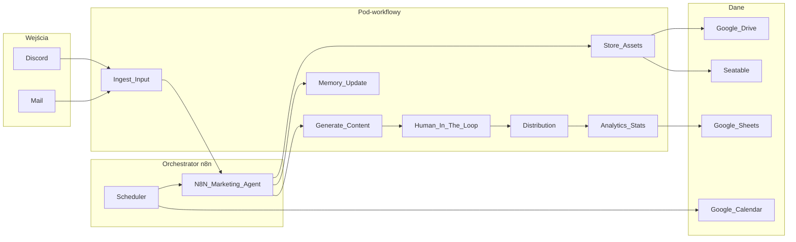

# Roadmap: CG Marketing Agent

Dokument zbiera ustalenia dotyczące automatyzacji marketingowej opartej na **n8n** (self-hosted). Diagram wyjściowy: [agent.excalidraw](agent.excalidraw). Zasady projektu: [shared-rules.md](shared-rules.md).

**Status:** roadmapa **w użyciu** — dokument żywy (edycje mile widziane); realizacja zgodnie z checklistą i iteracjami I0+.

**Powiązane pliki robocze:** [job-contract.md](job-contract.md) (kontrakt `job`), [decisions-three-variants.md](decisions-three-variants.md) (3 warianty decyzji), [credentials-registry.md](credentials-registry.md) (credential’e + koszty).

---

## P0 — do wykonania w pierwszej kolejności (API SeaTable)

**Status:** plan do **review i zatwierdzenia** przed wdrożeniem — pełna treść: [plans/event-driven-discord-seatable.md](plans/event-driven-discord-seatable.md) (sekcja *Review i zatwierdzenie* + checklisty).

**Dlaczego teraz:** harmonogramy **ingest** i **orchestrator** generują stały strumień zapytań do SeaTable; w praktyce **wyczerpują limity API** (quota planu). Celem jest start pracy od **zdarzenia Discord** (zamiast crona „sprawdzaj kolejkę”) oraz przetwarzanie **jednego** `job_id` na wywołanie zamiast listowania widoku `to-process` przy każdym ticku — szczegóły i diagramy w planie.

**Dla Adriana (AdiSzef):** jeśli sprawdzasz, **co jest do zrobienia** — **traktuj ten punkt jako priorytet #1** (limity SeaTable). Po akceptacji planu realizacja zgodnie z checklistą w pliku planu i `push-workflows` na VPS.

---

## Następny krok — dopracowanie CSS szablonów (slajdy / HCTI)

**Status:** zaplanowane po domknięciu kierunku P0 (lub równolegle, jeśli ktoś ma capacity).

**Kontekst:** obecny wygląd slajdów jest **w miarę ciekawy**, ale **nie do końca odpowiedni** (brand, czytelność, proporcje, spójność między kanałami). Trzeba iteracyjnie doprecyzować wizualnie i technicznie.

**Pliki / miejsca:**

- Szablon CSS w repo: [templates/hcti/career-guide-render.css](../templates/hcti/career-guide-render.css) (referencja / edycja lokalna).
- **Uwaga wdrożeniowa:** render PNG w produkcji może używać **`baseCss` wbudowanego w workflow** [cg-gen-content.json](../workflows/generate/cg-gen-content.json) (węzeł budujący HTML) — po zmianach stylów **zaktualizować oba** albo scentralizować proces (skrypt patch / jedno źródło prawdy), potem `node scripts/n8n/push-workflows.mjs` dla `cg-gen-content`.

**Kryteria „gotowe” (szkic):** akceptacja wizualna 1–2 układów testowych na LinkedIn / IG / FB, czytelność na mobile preview, zgodność z wytycznymi brandu.

---

## Zakres i założenia

- **Stack:** cała orkiestracja w **n8n** — orchestrator + mniejsze workflowy, przekazywanie danych przez ustandaryzowany JSON (np. `Execute Workflow` / webhooki).
- **Wdrożenie:** **bez n8n Cloud**. **Stan 2026-04:** główna instancja zespołu działa na **VPS** (self-hosted Docker: n8n + `hcti-render`, publiczny URL **`https://cg-agent.n8n.crait.pro`**, reverse proxy z TLS). **Lokalny** `docker compose` z repo służy nadal **developmentowi** i testom. Wcześniejsza strategia „długo tylko lokalnie + tunel” została **uzupełniona** wczesnym VPS dla stabilnego OAuth i webhooków (np. Discord **Send and Wait**); tunel/ngrok w compose pozostaje **opcjonalny dla pracy lokalnej**.
- **Koszt:** priorytet **niskiego nakładu** (darmowe tiery, świadome limity API); przy większych decyzjach obowiązuje **trzy warianty** (darmowy / niewielki koszt / drogi) z opisem **efektu**, nie tylko ceny.
- **Praca:** **iteracje** z pomiarem efektu i kosztu oraz **go/no-go** przed poszerzeniem zakresu.

---

## Co wynika z diagramu (agent.excalidraw)

**Wejście:** Discord, Mail — zdjęcia, filmiki, polecenia, materiały stałe (logo, avatar).

**Wyjście:** posty (Facebook, LinkedIn, X, Instagram), wideo (YouTube, TikTok, itd.), powiadomienia (Mail, Discord), **Human in the loop**.

**Środek:** agent z modelami, **HTCI** (szablon + logo + zdjęcia), **pamięć**, **dystrybucja** z **specyfikacją per kanał**, pętla **poprawka / wycofanie**, Scheduler, **N8N Marketing Agent**.

**Magazyn:** Google Drive i/lub Seatable, Google Kalendarz, Google Sheets. Opcje na brzegu: Discord?, BLOG SEO?, Statystyki?

**Przepływ treści (semantyka):** **agent zbiera i scala informacje ze wszystkich inputów** (kanały, polecenia, pliki, załączone zdjęcia i materiały, specyfikacja kanału wyjścia, pamięć, kalendarz itd.), **na tej podstawie składa zaawansowany prompt** (m.in. pod generację grafiki lub copy), który **steruje generowaniem treści**. Zdanie „prompt tworzy agenta” odrzuca **błędne uproszczenie**: że wystarczy jeden statyczny meta-prompt zamiast procesu agregacji — **to agent składa prompt pod konkretne zadanie z realnych wejść**, a nie odwrotnie.

**Architektura logiczna:** jeden **workflow-orchestrator** i **wiele pod-workflowów** (jedna odpowiedzialność każdy), wspólny **kontrakt danych** (`job`).

---

## Strategia wdrożenia: lokalnie (dev) + VPS (instancja zespołu)

| Etap | Opis |
|------|------|
| **Lokalnie (dev)** | n8n **self-hosted** z `docker compose` (np. `http://127.0.0.1:5679`). Publiczne webhooki / OAuth z laptopa: **tunel** (Cloudflare Tunnel, **ngrok** — profil `tunnel` w compose) albo pominięcie funkcji wymagających publicznego URL. |
| **VPS (główna instancja 2026-04)** | Ten sam model self-hosted: Docker na serwerze (np. katalog **`/opt/CGmarketingAgent`**), **stały URL** (`N8N_HOST`, `WEBHOOK_URL`, reverse proxy, TLS). Serwis **`hcti-render`** w tej samej sieci compose co n8n (`http://hcti-render:3000/render`). Import workflowów na pustą instancję: `node scripts/n8n/create-workflows-remote.mjs`. |
| **Docelowo (Faza 8 — utwardzenie)** | Backup volume / procedury, ewentualnie większy tier VPS, gdy system będzie bliżej produkcji masowej — **bez** zmiany zasady „własna instancja, nie n8n Cloud”. |
| **Po zmianie hosta** | **Aktualizacja redirect URI** i webhooków u providerów (OAuth, boty) na aktualny adres. |

**API n8n** (`N8N_API_URL`, `N8N_API_KEY`) dotyczy **Waszej** instancji — szablon zmiennych: [.env.example](../.env.example).

---

## Niski koszt — zasady operacyjne

- Orchestracja: **n8n self-hosted** (bez n8n Cloud).
- Dane: **Seatable** (free tier, 10k wierszy/bazę) jako główny magazyn `job`; **Google Drive** na assety; **Google Sheets** tylko do rejestru kosztów i raportów analitycznych.
- Wejścia: Discord Bot (serwer TEAM CG, kanał `cg-agent`), mail z istniejącej skrzynki gdy możliwe.
- AI: start od **tanich modeli / limitów** w workflow; lokalny LLM (Ollama) tylko gdy jakość i koszt czasu są akceptowalne.
- HTCI: **szablony + logo + upload** zanim płatna generacja obrazu; batch i cache.
- Social: **jeden kanał na iterację**; bez dodatkowych SaaS cross-post na start.
- VPS: **koszt hostingu** na głównej instancji od **2026-04** (mały VPS); skalowanie tieru po metrykach. Lokalny dev nadal **0 zł** na hosting n8n (poza ewentualnym tunelem).
- **Arkusz kosztów** (np. w Sheets): szacunki miesięczne — aktualizacja po każdej iteracji.

**Akceptowalny efekt** definiować **per iterację**, nie „wszystkie platformy od razu”.

---

## Trzy warianty przy decyzjach

Przy każdej większej decyzji (hosting, dane, AI, obrazy, kanał): zapisać **darmowy**, **niewielki koszt**, **drogi** oraz **jaki efekt** daje każdy.

| Wariant | Typowo | Efekt (realistycznie) |
|---------|--------|------------------------|
| **Darmowe** | Self-host, darmowe tiery, tunel z limitami, szablony zamiast gen AI, jeden kanał | Wąski zakres E2E; więcej HITL; limity tunelu |
| **Niewielki koszt** | Mały VPS, modele „mini”, Sheets w sensownych limitach | Stabilny URL, sensowna jakość copy, umiarkowany wolumen |
| **Drogie** | Większy VPS/GPU, flagowe modele, płatna baza, wiele kanałów naraz | Najmniej pracy ludzkiej, najwyższa jakość — wymaga kontroli ROI |

**Przykłady:** publiczny URL (**VPS ze stałą domeną** vs **tunel na laptopie** vs większy VPS+backup); warstwa `job` (Sheets vs Seatable vs baza); tekst (kredyty/tani model vs średni vs top); obrazy (tylko szablony vs tanie API vs premium); dystrybucja (jeden kanał vs więcej vs SaaS analytics).

W iteracji najpierw wariant **darmowy** lub **niewielki koszt**; **droższy** po pozytywnym pomiarze.

---

## Działanie iteracyjne

Zamiast realizować wszystkie fazy naraz — **krótkie iteracje**, przyrost działający, **pauza** na ocenę.

1. **Cel** — jedno zdanie (np. „Discord → arkusz + powiadomienie”).
2. **Zakres** — minimum do celu; dla nowych elementów **tabela 3 wariantów**.
3. **Implementacja** — pod-workflowy + kontrakt `job`.
4. **Pomiar** — jakość, liczba wywołań API, czas ludzi, koszt z paneli.
5. **Go/no-go** — poszerzenie zakresu / tieru albo obniżenie kosztu.

**Mapowanie iteracji (orientacyjnie):**

| Iteracja | Zakres | Status |
|----------|--------|--------|
| **I0** | Faza 0: lokalne n8n, konwencje, `.env`; opcjonalnie tunel | **done** — Docker, `.env.example`, onboarding, konwencje git, reguły IDE |
| **I1** | Faza 1–2: credential'e, kontrakt `job`, jedno wejście (Discord) + Seatable/Drive | **done** — kontrakt `job`, rejestr credentiali, Seatable; w n8n i repo: `cg-ingest-discord` (+ później orchestrator/gen); API n8n + eksport workflowów do `workflows/` |
| **I2** | Faza 3: ingest → orchestrator → HITL lub tania generacja tekstu | **done** — `cg-orchestrator-main` + `cg-gen-content` (Gemini), HITL przez Discord `sendAndWait`, widok `to-process` w Seatable (filtr na `ingested`/`revision_needed`), `concurrency: 1` w orchestratorze (brak równoległych runów); opcjonalnie twardszy rozdział **input vs feedback** (drugi kanał / reguły — patrz [decisions-three-variants.md § 4](decisions-three-variants.md)) |
| **I2b** | **P0:** Event-driven Discord → SeaTable — redukcja zapytań API (trigger / Execute Workflow zamiast crona listującego `to-process`); patrz [plans/event-driven-discord-seatable.md](plans/event-driven-discord-seatable.md) | **planned — priorytet (limity API)** |
| **I3** | Jeden kanał social; scheduler w wersji minimalnej (np. ręczny trigger) | planned |
| **I4+** | Faza 4 (agent, HTCI, pamięć), pełny scheduler, kolejne kanały, Faza 6 | planned |

Po **I2–I3** warto **zatrzymać się** na ocenę, zanim doda się drogie modele lub wiele integracji.

---

## Stan implementacji i otwarte problemy (2026-04-10)

**I3 (częściowo):** `cg-gen-content` generuje **osobne slajdy PNG** per kanał (JSON z LLM → parse → render HCTI); orchestrator po **ok** uploaduje pliki na **Google Drive** (folder **generated**, ID w węźle **Upload Approved Slide**), zapisuje **`final_slides`** + **`publish_at`** w Seatable; brak `publish_at` w job → **Discord Ask Publish Date**. Ingest Discord: domyślne `channels` (linkedin, facebook, instagram), opcjonalny parse daty z treści. W Seatable **dodać kolumnę** `final_slides` (Long Text) — opis: [job-contract.md](job-contract.md). Aktualizacja JSON na instancji: `node scripts/n8n/push-workflows.mjs` (`PUT`, gdy `id` w plikach = id na serwerze). **Nowa pusta instancja:** `node scripts/n8n/create-workflows-remote.mjs`. Oba wymagają `N8N_API_*` w `.env`.

---

## Stan implementacji i otwarte problemy (2026-04-09)

**Instancja n8n (VPS lub lokalnie):** **cg-ingest-discord**, **cg-gen-content** (sub-workflow), **cg-orchestrator-main** (schedule, widok `to-process`, generacja, HITL na Discordzie przez `sendAndWait`). **cg-hitl-discord-reply** (polling SeaTable) — **usunięty** z repo i z nowych wdrożeń; nie używać na serwerze. Skrypty `N8N_API_*` w `.env` powinny wskazywać **aktywną** instancję (dla zespołu: URL VPS).

**Repozytorium `workflows/`:** trzy główne eksporty ze skryptem `scripts/n8n/export.sh`: `ingest/`, `orchestrator/`, `generate/` (katalog `hitl/` zarezerwowany — patrz `workflows/hitl/README.md`).

**Ustalenia operacyjne (debug):**

- Węzeł SeaTable **Mark Generating** musi faktycznie wysłać aktualizację kolumny **`status` = `generating`** — pusta sekcja kolumn do wysłania powoduje, że job zostaje w kolejce i schedulery mogą **wielokrotnie** generować treść dla tego samego `job_id`.
- Widok **`to-process`** powinien obejmować wyłącznie stany **kolejki roboczej** (np. `ingested`, `revision_needed`) i **nie** zawierać `generating` ani `awaiting_approval` — inaczej ten sam rekord może być ponownie pobrany przy kolejnym ticku.

**Discord — feedback do postów (HITL), stan 2026-04-09:**

- **Naprawione:** w `cg-orchestrator-main` węzeł Discord **`sendAndWait`** ma **`responseType: freeText`**, a węzeł **Code** (Parse Response) odczytuje treść odpowiedzi z **`item.data.text`** (zgodnie z payloadem zwracanym przez ten węzeł) — zatwierdzenie / odrzucenie / feedback do poprawki trafiają do logiki i zapisu w Seatable. Aktualizacje wierszy w SeaTable w eksporcie używają **`columnsUi` / `columnValues`** (aktualny kształt węzła w n8n).
- **Publiczny URL dla webhooków Discord (Send and Wait):** na **VPS** — `WEBHOOK_URL` / `N8N_HOST` ustawione na **HTTPS domeny** (reverse proxy → `127.0.0.1:5679`). **Lokalnie** — opcjonalny **ngrok** w `docker-compose.yml` (profil `tunnel`, panel **http://127.0.0.1:4041**). Szczegóły: [docker-compose.yml](../docker-compose.yml), [.env.example](../.env.example).
- **Nadal świadomie:** jeden kanał dla **ingest** i **preview** — `cg-ingest-discord` od **2026-04-08** pomija wiadomości będące **reply** (`message_reference`) i przesuwa `discord_last_message_id`, żeby uniknąć pętli. Pełny rozdział treści (drugi kanał, prefiksy, klasyfikator) pozostaje **opcjonalnym** uszczelnieniem: [decisions-three-variants.md — § 4](decisions-three-variants.md).

---

## Architektura logiczna (n8n)



**Wzorzec:** orchestrator wywołuje pod-workflowy (**Execute Workflow** / webhook), payload: np. `job_id`, `channel_spec_id`, `assets[]`, `prompt_context`, `status`. Stan: **Sheets/Seatable** + **Drive** (wycofanie, wersje).

---

## Fazy roadmapy

### Faza 0 — Fundament

- n8n self-hosted (**VPS — instancja zespołu** i/lub **lokalnie**), backup volume, wersja zgodna z węzłami; bez n8n Cloud.
- Sekrety poza Gitem ([.env.example](../.env.example)).
- Nazwy workflowów: `cg-orchestrator-*`, `cg-ingest-*`, `cg-gen-*`, itd.

### Faza 1 — Credential’e

Matryca kont i integracji w **n8n Credentials** (osobno dev/prod jeśli potrzeba):

| Obszar | Serwis | Uwagi |
|--------|--------|--------|
| Orchestracja | n8n (self-hosted) | API Key — URL lokalny lub VPS |
| Wejścia | Discord, Mail | Bot token / IMAP/SMTP |
| Dane | Drive, Sheets, Calendar, Seatable? | OAuth / token |
| AI | Dostawca LLM | API key, limity |
| Obrazy / wideo | API zgodnie z HTCI | API key |
| Social | Meta, LinkedIn, X, YouTube, TikTok | OAuth; **największy nakład konfiguracji** — osobne „Developer App”, często **App Review** (czas, nie tylko pieniądze) |
| Opcjonalnie | Discord | Bot token |

**Uwaga (Meta / IG / FB):** „długa weryfikacja” to proces **App Review** / ewentualnie **Business Verification** po stronie Meta — **często tygodnie** zanim aplikacja dostanie potrzebne uprawnienia do publikacji w produkcji.

### Faza 2 — Kontrakt `job`

- Pola np.: `job_id`, `created_at`, `source`, `content_type`, `channels[]`, `assets`, `channel_specs`, `approval_status`, `publish_at`.
- Źródło prawdy: **Seatable** (relacje, widoki, REST API); Drive na assety binarne.
- Kalendarz: sloty powiązane z `job_id`.

### Faza 3 — Pierwszy pionowy slice

1. `cg-ingest-unified` — Discord/Mail → `job` + Drive.
2. `cg-store-assets` — logo, avatar, szablony HTCI.
3. `cg-orchestrator-main` — routing; **jeden kanał testowy**.
4. `cg-human-in-the-loop` — zatwierdzenia; aktualizacja statusu.
5. `cg-distribute-channel-*` — osobny workflow na platformę.

### Faza 4 — Agent i treści

- `cg-agent-build-content-prompt` (lub `cg-agent-synthesize-prompt`) — agregacja inputów → **jeden zaawansowany prompt** → generacja treści.
- `cg-htci-template` — szablon + logo + zdjęcia.
- `cg-memory-update` — pamięć operacyjna (Sheets/Seatable; opcjonalnie RAG później).

### Faza 5 — Scheduler

- `cg-scheduler` — Calendar + Sheets → `job` zaplanowany; retry + **idempotencja** (`job_id`).

### Faza 6 — Operacje

- Rollback: `external_post_id` → `cg-retract` gdzie API pozwala.
- Raporty SQL/statystyki z danych w Seatable/Sheets.

### Faza 7 (opcjonalna)

- Blog SEO, pełne analytics — po stabilnej publikacji.

### Faza 8 — VPS i utwardzenie operacyjne

**Stan 2026-04:** podstawowe wdrożenie na **VPS** (n8n + `hcti-render`, TLS, stały URL) jest **zrealizowane** wcześniej niż pierwotna kolejność „na sam koniec” — dla stabilnych integracji zewnętrznych.

**Do domknięcia w ramach Fazy 8 (iteracyjnie):** świadomy backup danych n8n (volume), ewentualnie wyższy tier VPS, runbook restartu, monitoring — **bez** zmiany modelu self-hosted.

- Docker na VPS, Nginx/Caddy + Let’s Encrypt, `N8N_HOST`, `WEBHOOK_URL`.
- Weryfikacja credentiali na produkcyjnym URL; aktualizacja OAuth i webhooków przy każdej zmianie domeny.

---

## Ryzyka i decyzje

- **Meta/IG/FB:** rezerwa czasu na **App Review**; osobne kroki (Business Manager, typ konta IG).
- **Seatable vs Sheets+Drive:** zdecydowano — Seatable jako główny magazyn `job`; Sheets zostaje tylko do kosztów/raportów.
- **Discord, Blog SEO, statystyki:** świadomie na później.
- **Lokalnie vs VPS:** **główna instancja na VPS** (2026-04); **lokalny** stack do dev; przy zmianie URL aktualizować redirect URI / webhooki u providerów.
- **API LLM/obrazy:** quoty w workflow; bez limitów rośnie rachunek.

---

## Checklist przed budową (po akceptacji roadmapy)

- [ ] Zatwierdzona treść `docs/roadmap.md` (ew. dopiski w `docs/agent.excalidraw`).
- [x] Trzy warianty dla: hostingu webhooków, magazynu `job`, pierwszego modelu AI — szablon: [decisions-three-variants.md](decisions-three-variants.md) (uzupełnij decyzje w treści).
- [x] Kontrakt JSON `job` — szkic: [job-contract.md](job-contract.md).
- [x] Lista credentiali — [credentials-registry.md](credentials-registry.md); rejestr kosztów: uzupełnij link do arkusza w tym pliku.
- [x] Uruchomienie n8n (Faza 0 / **I0**) — lokalnie: `docker compose up -d`, port **5679**; **VPS:** ten sam compose na serwerze + reverse proxy do UI.
- [x] **VPS (2026-04):** instancja zespołu pod **`https://cg-agent.n8n.crait.pro`**, `hcti-render` w stacku; workflowy zaimportowane (`create-workflows-remote.mjs` lub ręczny import).
- [x] Onboarding — [onboarding-local-setup.md](onboarding-local-setup.md).
- [x] Wersjonowanie workflow — struktura `workflows/`, skrypty eksport/import ([shared-rules.md](shared-rules.md) § 9).
- [x] Eksport workflow z n8n do repo — **trzy** pliki: ingest, orchestrator, gen-content (`scripts/n8n/export.sh`, `N8N_API_KEY`; legacy HITL reply usunięty).
- [x] Zaktualizować `job-contract.md` — Seatable jako źródło prawdy, opis aktualnej struktury tabel.
- [x] Opisać istniejącą bazę Seatable (tabele `jobs` + `config`, kolumny, widoki) w `job-contract.md`.

---

## TODO po uruchomieniu maszyny z workflow

Gdy będzie dostępna maszyna z działającymi workflow w n8n:

1. **Wygeneruj klucz API n8n:** n8n → Settings → API → dodaj klucz; wpisz go do `.env` jako `N8N_API_KEY`.
2. **Wyeksportuj workflow do repo:**
   ```bash
   bash scripts/n8n/export.sh
   ```
   Sprawdź czy pliki JSON trafiły do odpowiednich katalogów w `workflows/`.
3. **Przejrzyj eksport:** upewnij się, że credential'e nie zawierają sekretów (skrypt powinien je wyciąć).
4. **Zrób commit:**
   ```bash
   git add workflows/
   git commit -m "[MS] feat: export n8n workflows (ingest, orchestrator, gen-content)"
   git push
   ```
5. **Uzupełnij stan Seatable:** jeśli baza istnieje — opisz strukturę tabel w `job-contract.md` (tabele, kolumny, typy, relacje) i zaktualizuj uwagi implementacyjne (Sheets → Seatable).
6. **Odznacz checklistę** powyżej po wykonaniu kroków.

---

## Historia dokumentu

| Wersja | Opis |
|--------|------|
| 1.0 | Konsolidacja ustaleń: n8n self-hosted, lokalnie → VPS, niski koszt, 3 warianty, iteracje, przepływ agenta treści, fazy 0–7 |
| 1.1 | Migracja VPS przesunięta: dopiero gdy system blisko ukończenia; rozwój na lokalnym n8n + tunel |
| 1.2 | Renumeracja: migracja VPS z „Faza 0b” na **Faza 8** (logicznie na końcu, po 1–7) |
| 1.3 | Start pracy z roadmapą: szkic `job`, szablon 3 wariantów, rejestr credentiali; status „w użyciu” |
| 1.4 | Aktualizacja statusu iteracji (I0 done, I1 w toku); checklist: n8n działa, onboarding, wersjonowanie workflow w repo (`workflows/`, skrypty eksport/import) |
| 1.5 | Stan n8n: orchestrator + gen-content + eksport 4 workflowów; Mark Generating / widok `to-process`; **otwarty temat:** input vs feedback na Discordzie (kanał / flagi / router AI) — [decisions-three-variants.md § 4](decisions-three-variants.md) |
| 1.6 | Ingest Discord: pomijanie reply (`message_reference`), spójne przesuwanie `discord_last_message_id`; dokumentacja §4 / job-contract zaktualizowane |
| 1.7 | HITL: `freeText` + parsowanie `data.text` w orchestratorze; SeaTable `columnsUi` w eksporcie; opcjonalny ngrok w Docker Compose (`tunnel`, :4041); roadmap § stan / I2 |
| 1.8 | Wdrożenie głównej instancji na **VPS** (`cg-agent.n8n.crait.pro`), `hcti-render` w compose; dokumentacja: dev lokalnie vs prod VPS; Faza 8 jako utwardzenie operacyjne |
| 1.9 | **P0** w roadmapie: plan event-driven Discord → SeaTable ([plans/event-driven-discord-seatable.md](plans/event-driven-discord-seatable.md)), review przed wdrożeniem; notatka priorytetu dla zespołu (limity SeaTable API) |
| 1.10 | Kolejny krok: dopracowanie CSS szablonów slajdów (HCTI) — sekcja w roadmapie, powiązanie `career-guide-render.css` + `baseCss` w `cg-gen-content` |
